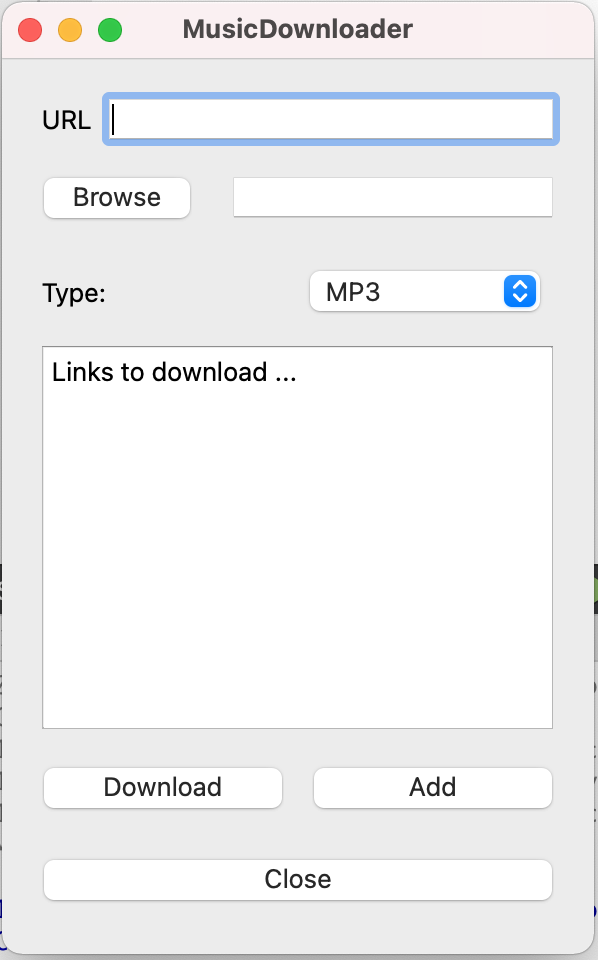

# YouTube Media Downloader
This GUI allows downloading mp3/mp4 videos. <br>
 
# SETUP
On a MacOS: <br>
1 - Install brew: 
```sh
ruby -e "$(curl -fsSL https://raw.githubusercontent.com/Homebrew/install/master/install)" < /dev/null 2> /dev/null"
```
2 - Install youtube-dl and ffmpeg:
```sh
brew install youtube-dl ffmpeg
```
3 - Qt needs to be installed.

# USAGE
Running YMD, the window below should appear.


1. Field "url" should be filled with the unique youtube url you want to download. <br>
1. Second field should point to the folder in which you want the video to be downloaded.
<br>
1. Select the format in which you want to download the video (either MP4 or MP4). 
<br>
1. Click on the **Add** button. The url of the video should appear in the box containing "Links to download ... "If you wish to download more than 1 video, repeat step 1 and 2. <br>
1.  Click on the **Download** button to start downloading. <br>
A log file named *log.txt* is added in the same directory as the downloaded video. This file allows to traces info and error logs. 